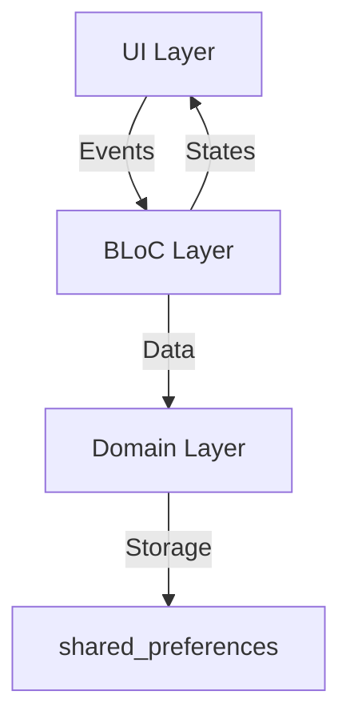

# 🛒 GroceryMart - Flutter Grocery Shopping App

**A production-ready grocery shopping app built with Flutter using BLoC architecture**

[](https://flutter.dev/)
[](https://bloclibrary.dev/)
[](https://flutter.dev/multi-platform)

---

## 🎯 Key Features

### 🛍️ Core Functionality
- **Real-time Cart Management** (Add/Remove/Update items)
- **Product Category Browsing**
- **Persistent Cart Storage** using `shared_preferences`

### ✨ UI/UX
- Smooth Lottie animations
- Responsive layouts for all devices
- Centralized navigation system

---

## 🏗️ Architecture Overview



### Architectural Decisions
1. **BLoC Pattern** (`flutter_bloc` v9.1.1)
2. **Clear Layer Separation**:
   - Presentation (UI)
   - Business Logic (BLoC)
3. **Centralized Routing**

---

## 🛠️ Technology Stack

| Package | Purpose | Version |
|---------|---------|---------|
| `flutter_bloc` | State management | ^9.1.1 |
| `shared_preferences` | Local storage | ^2.5.3 |
| `lottie` | Animations | ^3.3.1 |
| `cupertino_icons` | iOS-style icons | ^1.0.8 |

---

## 🚀 Getting Started

### Prerequisites
- Flutter 3.8+
- Dart 3.8+

### Installation
```bash
git clone https://github.com/cybersleuth0/GroceryMart.git
cd GroceryMart
flutter pub get
flutter run
```

---

## 📂 Project Structure

```
lib/
├── app_constant/      # Routes & constants
├── bloc/              # State management
├── domain/            # Data models
├── ui_pages/          # Screens & widgets
└── main.dart          # App entry
assets/
├── images/            # Product images
├── lottie_animations/ # Animation files
└── fonts/             # Custom fonts
```

---

## 📈 Future Enhancements

1. Advanced product search
2. Offline caching
3. User authentication
4. Theme customization
5. Improved accessibility

---

## 🤝 Contributing

We welcome:
- Bug reports via GitHub Issues
- Feature requests via Discussion board
- Code contributions via PRs

